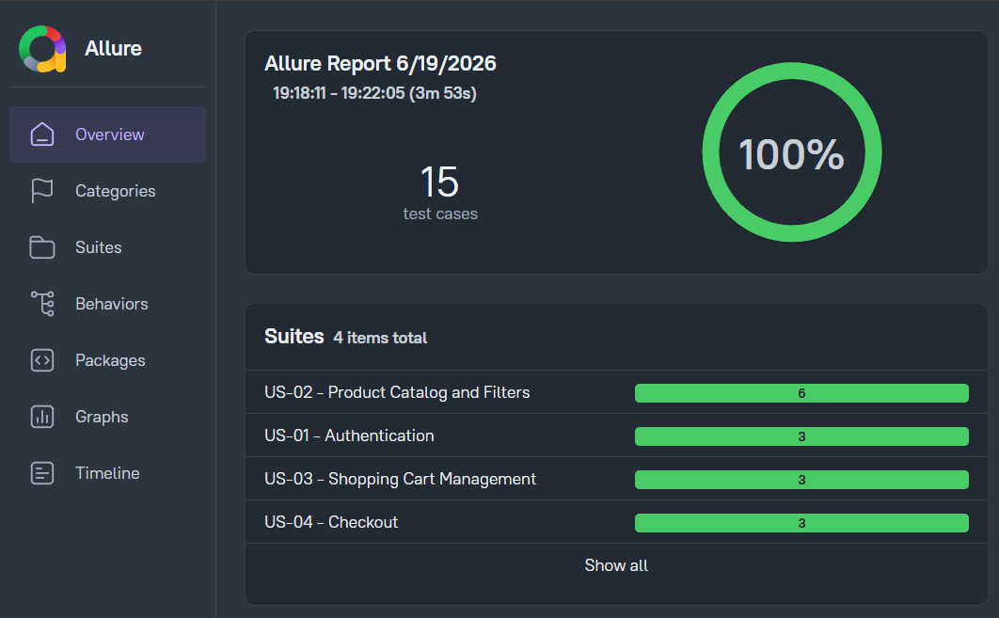
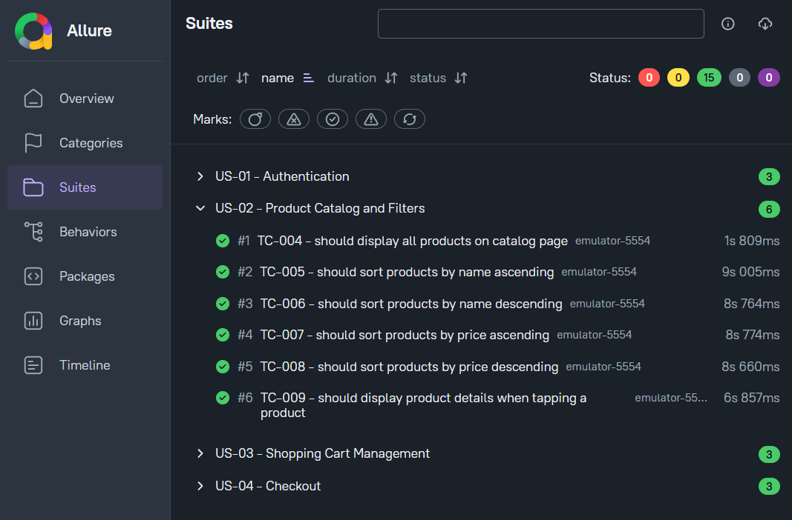
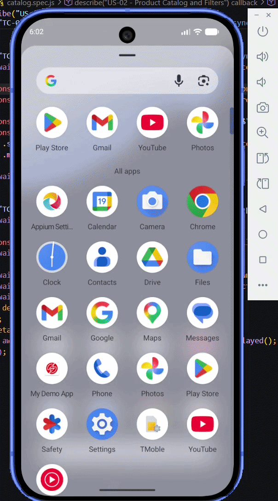

# 📱 Mobile E2E Testing with Appium + WebdriverIO

Automated end‑to‑end tests for an Android application using Appium, WebdriverIO, and Allure Reports, running locally on an Android emulator.

## 📌 Features
- End‑to‑end tests for Android
- Page Object Model (POM)
- WebdriverIO
- Appium (UiAutomator2)
- Local execution on Android Emulator
- Allure Reports

## 📊 Allure Reports



## 🗂 Project Structure
```
├── test
│   ├── specs          # Test cases
│   ├── pageObjects    # Page Object Model
│   ├── helpers        # ui helpers
│   └── data           # Test data
├── wdio.conf.js       # WDIO config
├── package.json
└── README.md
```

## 🛠 Tech Stack

- Appium
- Javascript (Node.js)
- WebdriverIO
- UiAutomator2
- Mocha
- Allure Reports

## Test Coverage

| User Story | Description | Tests |
|------------|-------------|-------|
| US-01 | Authentication | 3 |
| US-02 | Catalog & Filters | 6 |
| US-03 | Cart Management | 3 |
| US-04 | Checkout | 3 |

## Prerequisites

- Node.js 20
- Android Studio + AVD (Android 17)
- Java JDK 11

## Setup

```bash
npm install
appium driver install uiautomator2
```

## 🚀 Run Locally

### 1. Clone the repository

```bash
git clone https://github.com/luisdavidparra/mobile-e2e-appium-wdio
```

### 2. Install dependencies

```bash
npm install
```

### 3. Start emulated android device

From Android Studio

### 4. Run tests

```bash
npm test
```

## 📊 Test Report

After running the tests:

```bash
npm run report
```

## 🎥 Test Execution (GIF)

